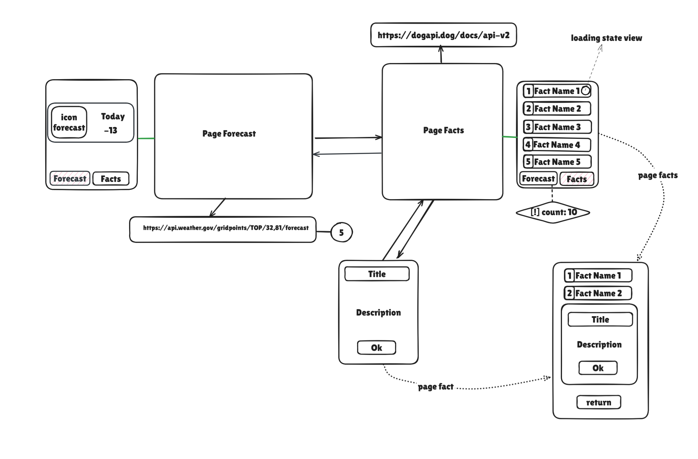
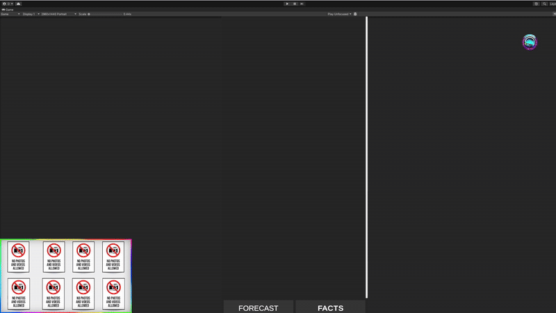
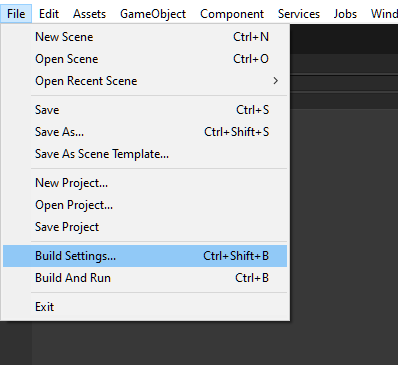
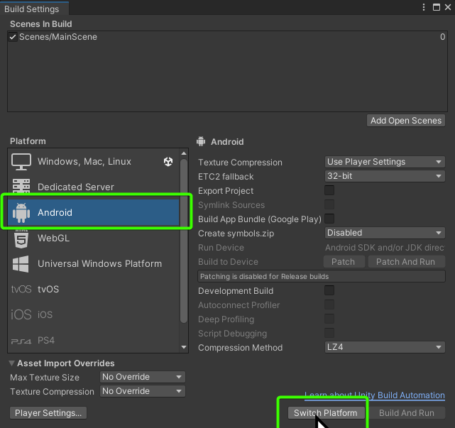

✨Dvurechensky✨

# Тестовое задание компании 🌟 ЦИФКОР 🌟

    

        
        
        
    

## 📕 ВНИМАНИЕ 📕
- В задаче я не увидел каков должен быть BUILD, под какие системы собрать сборки, поэтому счёл не собирать SDK и не класть их в репозиторий

## Технологии 👤
- 📋 UniTask
- 📋 Addressables
- 📋 Zenject
- ✂️ UniRx - так и не удалось его использовать, я фанат ECS и поэтому мне не удалось придумать где бы я мог это применить в этом не ECS проекте (ибо он запрещён в задании), но рад буду рекомендациям!

### Пояснения 📗
- Есть `отдельный ObjectPool` который призван централизованно отдавать объекты таблицам.Использование Addressables для кэширования объектов также вписывается в эту логику.
- Использую контроллеры для управления состоянием и логикой взаимодействия между компонентами, что вполне соответствует паттерну `MVC`
- `MVP` в моём контексте тоже возможно: контроллеры (как модели) взаимодействуют с представлениями, обновляя их в зависимости от данных. Разделение ответственности между логикой и интерфейсом также соблюдается.
- **`Zenject (Factory/Pool)`** - Активно использую Zenject для инъекции зависимостей. Инъекции позволяют отделить логику создания объектов от их использования, что идеально подходит для использования паттернов типа Factory.

- 📘 В дополнении я сделал кеширование иконок погоды после первой загрузки их с сервера

## Информация от компании 🌁
[Текст тестового задания](<Media/Тестовое задание Cifkor 17.02.2025.pdf>)

## Информация от меня 🌊

💨 Я своё понимание этого задания постарался описать в этом изображении❕
 

💨 Видео

    

## 👀 Сборка 👀
- После удаления папки `Library` перед релизом сбрасывается выбор платформы под которую создавался проект.

✨Dvurechensky✨
