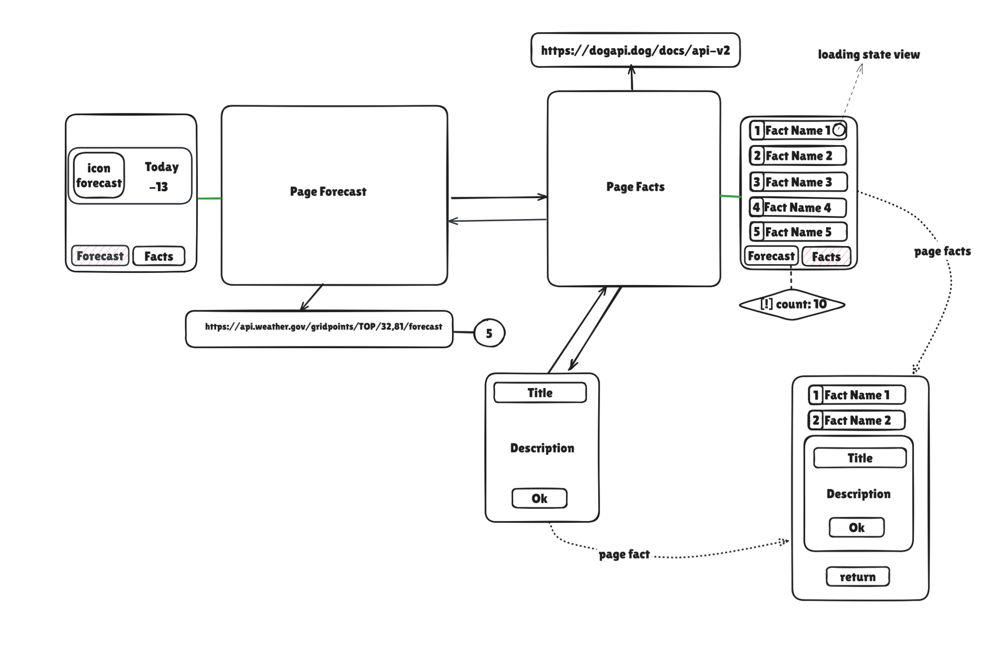
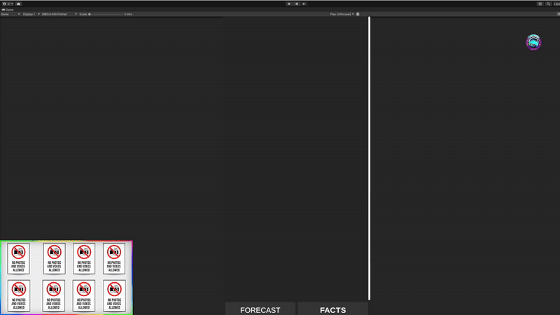
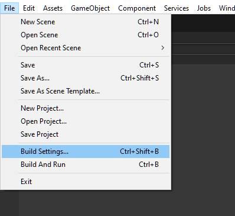
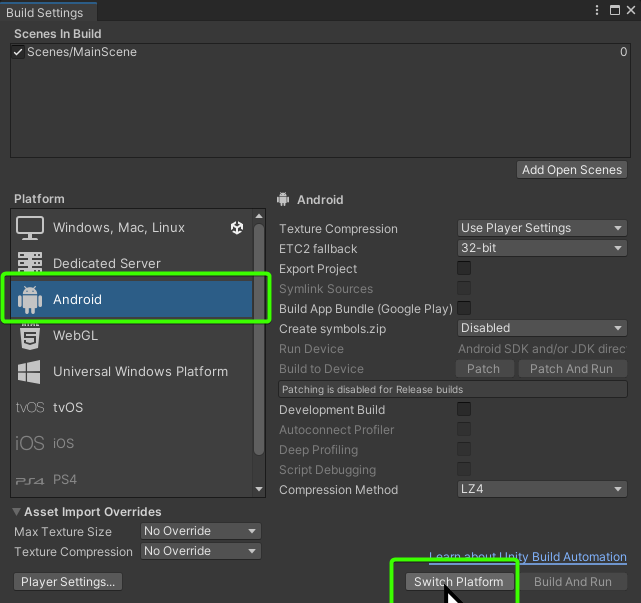

✨Dvurechensky✨

<h1 align="center"> Test Assignment for 🌟 CIFCORE 🌟 Company</h1>

    

        
        
        
    

  <strong>🌐 Language: </strong>
  
  <a href="./README.ru.md" style="color: #F5F752; margin: 0 10px;">
    🇷🇺 Russian
  </a>
  | 
  
    ✅ 🇺🇸 English (current)
  

---

# ✨ Table of Contents

- [✨ Table of Contents](#-table-of-contents)
  - [📕 ATTENTION 📕](#-attention-)
  - [Technologies 👤](#technologies-)
    - [Notes 📗](#notes-)
  - [Information from the Company 🌁](#information-from-the-company-)
  - [Information from Me 🌊](#information-from-me-)
  - [👀 Build 👀](#-build-)

## 📕 ATTENTION 📕

- The task did not specify what kind of BUILD was required or for which platforms the builds should be created, so I decided not to build SDKs or include them in the repository

## Technologies 👤

- 📋 UniTask
- 📋 Addressables
- 📋 Zenject
- ✂️ UniRx — was not able to integrate it in the end

### Notes 📗

- There is a **separate ObjectPool** designed to centrally provide objects to tables. Using Addressables for object caching also fits naturally into this logic.
- I use controllers to manage state and interaction logic between components, which aligns well with the `MVC` pattern.
- `MVP` is also applicable in my context: controllers (as models) interact with views, updating them based on data. Separation of concerns between logic and UI is maintained.
- **`Zenject (Factory/Pool)`** — actively used for dependency injection. DI allows separating object creation logic from usage, which is ideal for patterns like Factory.

- 📘 Additionally, I implemented caching for weather icons after their first load from the server

## Information from the Company 🌁

[Task description](<Media/Тестовое задание Cifkor 17.02.2025.pdf>)

## Information from Me 🌊

💨 I tried to describe my understanding of the task in this image ❕

💨 Video

    

## 👀 Build 👀

- After deleting the `Library` folder before release, the selected build platform resets

✨Dvurechensky✨

